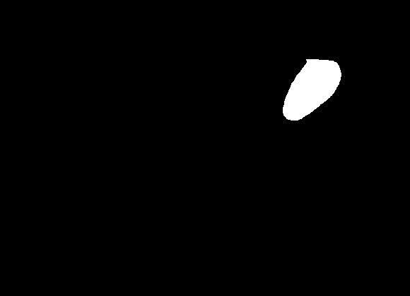

# Ultrasound Nerve Segmentation
### By Arda Mavi

Ultrasound nerve segmentation with deep learning. 
Database from [Kaggle](https://www.kaggle.com/c/ultrasound-nerve-segmentation).

### Segmentation Example:
|||
|:-:|:-:|
| Ultrasound Image | Mask |

### Using Predict Command:
`python3 predict.py <ImageFileName>`

### Model Training:
`python3 train.py`

### Using TensorBoard:
`tensorboard --logdir=Data/Checkpoints/logs`

### Model Architecture:
- Input Data
Shape: 100x100x1

- Convolutional Layer
32 filter
Filter shape: 3x3
Strides: 1x1

- Activation
Function: ReLu

- Convolutional Layer
64 filter
Filter shape: 3x3
Strides: 1x1

- Activation
Function: ReLu

- Transpose Convolutional Layer
64 filter
Filter shape: 3x3
Strides: 1x1

- Activation
Function: ReLu

- Merge Layer

- Transpose Convolutional Layer
1 filter
Filter shape: 3x3
Strides: 1x1

- Activation
Function: Sigmoid

##### Optimizer: Adadelta
##### Loss: Dice Coefficient

### Important Notes:
- Used Python Version: 3.6.0

- Install necessary modules with `sudo pip3 install -r requirements.txt` command.
